# Anime Patchwork Sleeve

### Amazing blog of Gibli Tattoos (with references)

https://tattoodesign.com/blog/studio-ghibli-tattoo/

Gibli Medley  
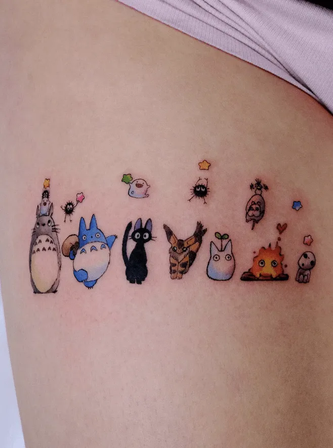  
Howl's Moving Castle  
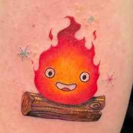  
Laputa  
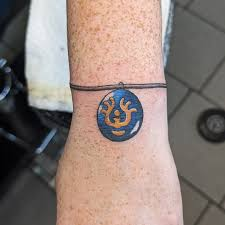  
Princess Mononoke  
  
Totoro  
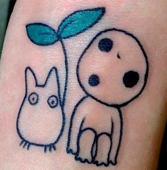  
Nauvis of the Valley of the Wind  
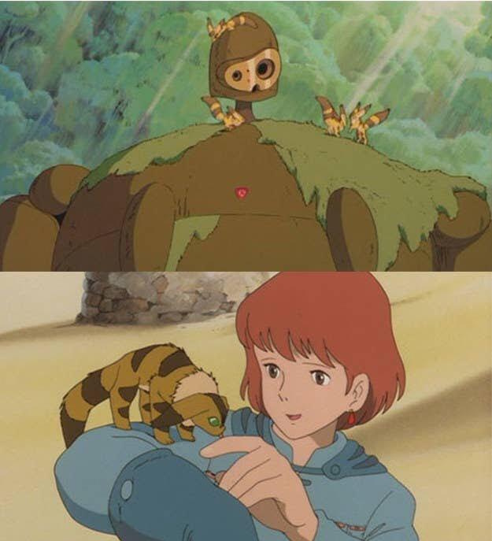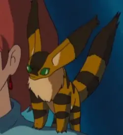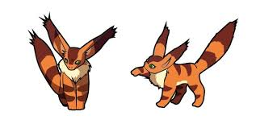  
Porco Rosso  
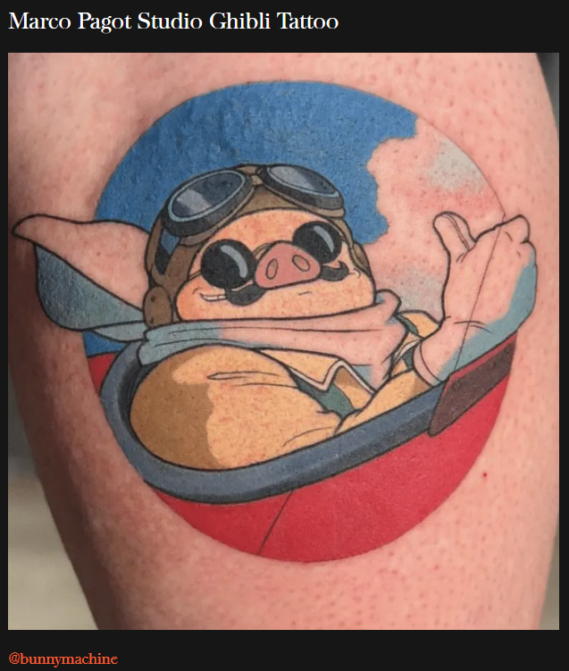  
A Silent Voice  
Frieren  
Arcane  
Avatar the Last Airbender  
Attack on Titan  
Perfect Blue

Pantheon  
Steins Gate  
Cyberpunk Edgerunners  
Psychopass  
Darling in the Franxx  
Ghost in the Shell

# Cyberpunk Sleeve

Solar System Base  
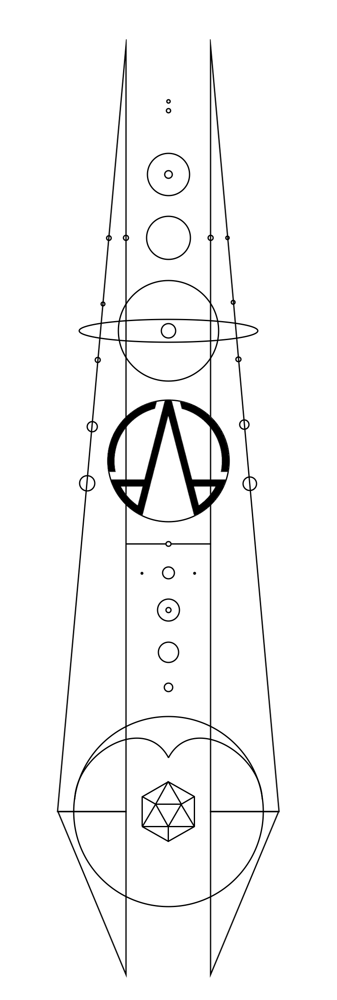  
The Expanse  
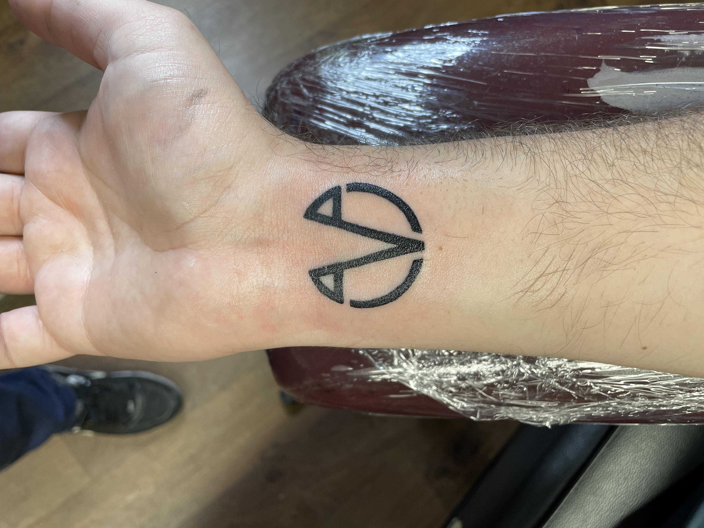  
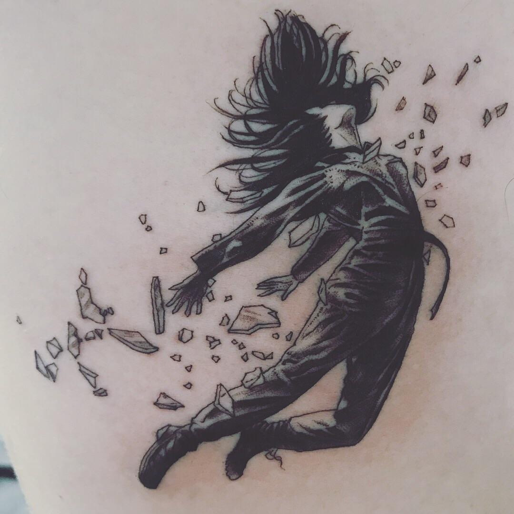

Foundation  
Altered Carbon  
Dark

# Back Ideas

Arcane Vi  
  
Cyberpunk Idea 1  
  
Cyberpunk Idea 2  

